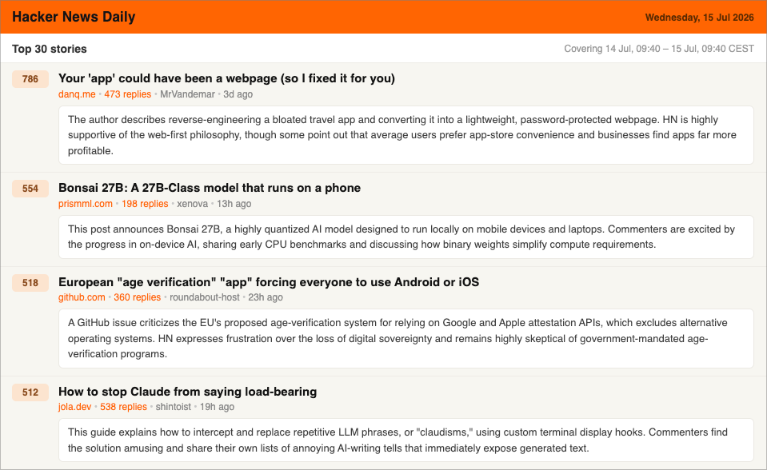

# Hacker News Daily digest 📰

A **completely free**, self-hosted email newsletter that sends you the top
[Hacker News](https://news.ycombinator.com/) stories every morning, each with a
short AI summary (article + community reaction) and links to both the article and
its HN discussion.

No servers, no paid services, no n8n. Just a **GitHub Action** on a cron schedule.

<p align="center">
  <em>Top-N stories · AI summaries by Google Gemini · delivered over Gmail SMTP</em>
</p>

📄 **[See a sample](https://pyxelr.github.io/hackernews-daily-digest/example-digest.html)** (generated from the [.html file](docs/example-digest.html)).

<p align="center">
  
</p>

## Project structure

```text
.
├── .github/workflows/          # GitHub Actions (daily cron + manual dispatch)
│   └── daily-digest.yml
├── docs/
│   ├── example-email.png       # Screenshot shown in this README
│   └── example-digest.html     # Sample rendered email (open in a browser)
├── src/
│   ├── config.py               # Env-based configuration
│   ├── hn_client.py            # Hacker News API client (stories + comments)
│   ├── article_fetcher.py      # Best-effort article text extraction
│   ├── summarizer.py           # Gemini summaries (batched, paced + retried)
│   ├── schedule.py             # Reads the workflow cron -> "next run" time
│   ├── email_renderer.py       # HTML email template
│   ├── mailer.py               # Gmail SMTP sender
│   └── list_models.py          # Helper: list models your API key supports
├── main.py                     # Orchestrator (fetch -> summarize -> send)
├── pyproject.toml              # Project metadata & dependencies (uv)
├── uv.lock                     # Locked, reproducible dependency versions
├── .env.example                # Template for local environment variables
└── README.md                   # This file
```

---

## Why it's free

| Piece | Service | Cost |
|-------|---------|------|
| Scheduling / compute | **GitHub Actions** | Free, *unlimited minutes* for public repos |
| Story data | **Hacker News Firebase API** | Free, no auth, no rate limits |
| AI summaries | **Google Gemini API** ([free tier](https://ai.google.dev/gemini-api/docs/pricing)) | Free; stories are batched into ~4 requests/day |
| Email delivery | **Gmail SMTP** (app password) | Free |

> The consumer **Google AI Pro** subscription is *not* required; the Gemini API
> has its own [**free tier**](https://ai.google.dev/gemini-api/docs/pricing) (the
> pricing page lists the Free, Paid, and Enterprise tiers) available to any Google
> account.

## How it works

```
GitHub Actions (cron, ~05:17 Poland time)
        │
        ▼
  main.py  ──▶  Hacker News API      (top 30 stories + top comments)
        │  ──▶  fetch article pages   (best-effort text extraction)
        │  ──▶  Google Gemini         (batched: ~8 stories per request)
        │  ──▶  render HTML email
        ▼
   Gmail SMTP  ──▶  your inbox 📬
```

Each story in the email shows its **rank** (#1, #2, …), **score**, **title**
(→ article), source domain, **N replies** (→ HN discussion), author, age, and a
concise 1-2 sentence summary.

---

## Setup (≈ 10 minutes)

### 1. Fork / use this repo
Fork it (or click **Use this template**) into your own account so the Action runs
under your quota. Keep it **public** for free unlimited Actions minutes.

### 2. Get a free Gemini API key
Go to **[aistudio.google.com/apikey](https://aistudio.google.com/apikey)** → *Create API key*. Copy it.

### 3. Create a Gmail App Password
1. Enable **2-Step Verification** on your Google account.
2. Go to **[myaccount.google.com/apppasswords](https://myaccount.google.com/apppasswords)**.
3. Create a password (name it e.g. "HN digest"). Copy the 16-character value.

> **Tip:** consider using a **dedicated Gmail account** as the sender (e.g.
> `you.news@gmail.com`) instead of your personal one. It keeps the daily digest
> out of your personal *Sent* folder, gives the newsletter its own avatar (set a
> profile picture on that account), and isolates it. Point `RECIPIENTS` at your
> real inbox.

### 4. Add repository secrets
In your repo: **Settings → Secrets and variables → Actions → New repository secret**.

| Secret | Value |
|--------|-------|
| `GEMINI_API_KEY` | your Gemini key |
| `GMAIL_USERNAME` | `you@gmail.com` |
| `GMAIL_APP_PASSWORD` | the 16-char app password |
| `RECIPIENTS` | *(optional)* comma-separated recipients; defaults to `GMAIL_USERNAME` |

Optional **Variables** (same page, *Variables* tab) to tweak without editing code:
`NUM_STORIES` (default `30`), `GEMINI_MODEL` (default [`gemini-3.6-flash`](https://ai.google.dev/gemini-api/docs/models/gemini-3.6-flash)).

> **Model not available?** Gemini model IDs change over time. If a run fails with
> a `404 ... model is no longer available` error, list what your key supports and
> set `GEMINI_MODEL` to one of them:
>
> ```bash
> GEMINI_API_KEY=your-key uv run python -m src.list_models
> ```

### 5. Test it
Go to **Actions → Daily HN Digest → Run workflow**.
- Tick **Dry run** to build the email as a downloadable artifact without sending.
- Leave it unticked to send a real email.

### 6. Done
It now runs automatically every day at **≈ 05:17 Poland time**, year-round.

> **How the timing survives daylight saving:** GitHub cron is UTC-only and
> ignores DST, so the workflow schedules *two* UTC times (`03:17` and `04:17`)
> and a guard (`RUN_ONLY_AT_LOCAL_HOUR=5`) lets only the run that actually lands
> on 05:xx in `DISPLAY_TIMEZONE` proceed; the other exits in seconds. To change
> the time, edit the two `cron` lines and the guard hour in
> [`.github/workflows/daily-digest.yml`](.github/workflows/daily-digest.yml)
> (times there are **UTC**; [crontab.guru](https://crontab.guru) helps).

---

## Run locally (without GitHub Actions)

The whole digest runs as a plain Python script, so you can generate or send it
from your own machine with no GitHub Actions involved. You only need a Gemini API
key; Gmail credentials are needed solely for the real send.

Dependencies are managed with [uv](https://docs.astral.sh/uv/) (install it first,
then run):

```bash
uv sync                   # creates a virtualenv from uv.lock
cp .env.example .env      # then fill in your keys

# Preview only: writes output/digest.html and sends nothing.
# Needs just GEMINI_API_KEY. Open the file in a browser to see the result.
DRY_RUN=true uv run python main.py

# Send for real (needs GMAIL_USERNAME + GMAIL_APP_PASSWORD too).
uv run python main.py
```

This is exactly what the GitHub Action does; it just runs the same `python
main.py` on a schedule. Running locally is handy for previewing layout changes or
sending an ad-hoc digest.

## Trigger a run manually

You don't have to wait for the daily schedule; you can run it any time:

**From GitHub (no setup needed):** open **Actions → Daily HN Digest → Run
workflow**. Tick **Dry run** to build a downloadable HTML artifact without
sending, or leave it unticked to send a real email.

**From your terminal** (needs the [`gh` CLI](https://cli.github.com/)):

```bash
gh workflow run "Daily HN Digest" -f dry_run=true    # preview (no email)
gh workflow run "Daily HN Digest"                    # send for real
```

> Manual runs always execute immediately and **bypass the daylight-saving guard**
> (that guard only applies to the scheduled cron runs).

## Configuration

All settings are environment variables (see [`.env.example`](.env.example)):

| Variable | Default | Description |
|----------|---------|-------------|
| `GEMINI_API_KEY` | — | Gemini API key (required) |
| `GEMINI_MODEL` | `gemini-3.6-flash` | Model used for summaries |
| `GMAIL_USERNAME` | — | Sender Gmail address |
| `GMAIL_APP_PASSWORD` | — | Gmail app password |
| `RECIPIENTS` | sender | Comma-separated recipients |
| `NUM_STORIES` | `30` | Stories per email |
| `MIN_SCORE` | `0` | Skip stories below this score |
| `MAX_COMMENTS` | `6` | Top comments fed to the summarizer |
| `BATCH_SIZE` | `8` | Stories summarized per Gemini request |
| `DISPLAY_TIMEZONE` | `Europe/Warsaw` | Timezone for timestamps shown in the email |
| `DISPLAY_TZ_LABEL` | *(empty)* | Force a fixed tz label; empty = DST-aware (CET/CEST) |
| `RUN_ONLY_AT_LOCAL_HOUR` | *(empty)* | DST guard: only run at this local hour on schedule |
| `FETCH_ARTICLES` | `true` | Also fetch article bodies for context |
| `REQUEST_DELAY_SECONDS` | `6` | Pause between Gemini batches (free-tier pacing) |
| `DRY_RUN` | `false` | Write HTML file instead of emailing |

## Notes & troubleshooting

- **Gemini free-tier rate limits** are per-minute. Stories are summarized in
  batches (`BATCH_SIZE`, default 8), so 30 stories cost only ~4 requests. If you
  still see `429` retries, lower `BATCH_SIZE` or raise `REQUEST_DELAY_SECONDS`.
- **`404 model not available`?** Model IDs get deprecated. Run
  `uv run python -m src.list_models` and set the `GEMINI_MODEL` variable to a listed one.
- **Some articles won't be fetched** (paywalls, JS-only, PDFs, videos). The
  summary then falls back to the title + HN comments, which is usually enough.
- **Email in spam?** Mark it "not spam" once; sending to yourself is very reliable.
- **Scheduled runs can be delayed** by GitHub during peak load (we have seen a
  couple of hours); this is normal GitHub Actions behaviour, not a bug here. The
  digest still sends that day, just later.
